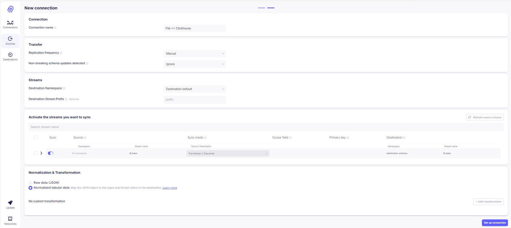

# Setting up Clickhouse cluster of base and predict customer shopping data with visualisation of results
Tools:
1. EDA, data processing, feature engineering, machine learning:
 - Python with Google colab enviroment:
     - Pandas
     - Numpy
     - CatBoost
     - Sklearn
2. Developer Enviroment:
 - Devcontainer
3.  Deploy Infrastructure:
 - Yandex.Cloud
 - Terraform
4. Data Pipelines:
 - Airbyte
5. Data modeling:
 - DBT
6. Data visualization
 - Yandex DataLens
 - Power BI

## Plan

- [Creating a Forecast Using ML Methods in Google Colab](#1-Create-a-Forecast-of-revenue-with-CatBoost-Library)
- [Configure Developer Environment](#2-Configure-Developer-Environment-with-devcontainer)
- [Deploy Infrastructure to Yandex.Cloud with Terraform](#3-deploy-infrastructure-to-yandexcloud-with-terraform)
    - Get familiar with Yandex.Cloud web UI
    - Configure `yc` CLI
    - Populate `.env` file, Set environment variables
    - Deploy using Terraform: VM with Airbyte installed, S3 Bucket, Clickhouse
- [Access Airbyte](#4-access-airbyte)
- [Configure Data Pipelines](#5-configure-data-pipelines)
    - Configure Object Storage Source
    - Configure Clickhouse Destination
    - Sync data to Destination
- [Create data marts with dbt](#6-Create-data-marts-with-dbt)
    - Create DBT Model
    - Run DBT model
- [Create dashboards with Yandex Datalens and Power BI](#7-Create-dashboards-with-Yandex-DataLens-and-Power-BI)  
- [Delete cloud resources](#8-delete-cloud-resources)

## Infrastructure

    

## 1. Create a Forecast of revenue with CatBoost Library

https://github.com/neworderby/dbt_ml_retail/blob/d12a59c2e44f998559813fd1470da6eeda7bd625/Forecast/Forecast_Retail_CatBoost.ipynb

https://github.com/neworderby/Python_EDA_ML_DataViz/blob/c8f921eb90524208cd05177dfad38f85ed088466/Forecast_Retail_CatBoost.ipynb

## 2. Configure Developer Environment with devcontainer

1. Install [Docker](https://docs.docker.com/desktop/#download-and-install) on your local machine.

1. Install devcontainer CLI:

    Open command palette (CMD + SHIFT+ P) type *Install devcontainer CLI*

    

1. Next build and open dev container:

    ```bash
    # build dev container
    devcontainer build .

    # open dev container
    devcontainer open .
    ```

</p>
</details>

Verify you are in a development container by running commands:

```bash
terraform -v

yc --version

dbt --version
```

If any of these commands fails printing out used software version then you are probably running it on your local machine not in a dev container!

## 3. Deploy Infrastructure to Yandex.Cloud with Terraform

1. Get familiar with Yandex.Cloud web UI

    We will deploy:
    - [Yandex Compute Cloud](https://cloud.yandex.com/en/services/compute)
    - [Yandex Object Storage](https://cloud.yandex.com/en/services/storage)
    - [Yandex Managed Service for ClickHouse](https://cloud.yandex.com/en/services/managed-clickhouse)
    
    

1. Configure `yc` CLI: [Getting started with the command-line interface by Yandex Cloud](https://cloud.yandex.com/en/docs/cli/quickstart#install)

    ```bash
    yc init
    ```

1. Populate `.env` file

    `.env` is used to store secrets as environment variables.

    Copy template file [.env.template](./.env.template) to `.env` file:
    ```bash
    cp .env.template .env
    ```

    Open file in editor and set your own values.

    > ❗️ Never commit secrets to git    

1. Set environment variables:

    ```bash
    export YC_TOKEN=$(yc iam create-token)
    export YC_CLOUD_ID=$(yc config get cloud-id)
    export YC_FOLDER_ID=$(yc config get folder-id)
    export TF_VAR_folder_id=$(yc config get folder-id)
    export $(xargs < .env)

    ## DEBUG
    # export TF_LOG_PATH=./terraform.log
    # export TF_LOG=trace
    ```

1. Deploy using Terraform

    Configure YC Terraform provider:
    
    ```bash
    cp terraformrc ~/.terraformrc
    ```

    Get familiar with Cloud Infrastructure: [main.tf](./main.tf) and [variables.tf](./variables.tf)

    ```bash
    terraform init
    terraform validate
    terraform fmt
    terraform plan
    terraform apply
    ```

    

    


    Store terraform output values as Environment Variables:

    ```bash
    export CLICKHOUSE_HOST=$(terraform output -raw clickhouse_host_fqdn)
    export DBT_HOST=${CLICKHOUSE_HOST}
    export DBT_USER=${CLICKHOUSE_USER}
    export DBT_PASSWORD=${TF_VAR_clickhouse_password}
    ```

    [EN] Reference: [Getting started with Terraform by Yandex Cloud](https://cloud.yandex.com/en/docs/tutorials/infrastructure-management/terraform-quickstart)
    
    [RU] Reference: [Начало работы с Terraform by Yandex Cloud](https://cloud.yandex.ru/docs/tutorials/infrastructure-management/terraform-quickstart)

## 4. Access Airbyte

1. Get VM's public IP:

    ```bash
    terraform output -raw yandex_compute_instance_nat_ip_address
    ```

2. Lab's VM image already has Airbyte installed

    <details><summary>I have prepared VM image and made it publicly available:</summary>
    <p>

    https://cloud.yandex.com/en-ru/docs/compute/concepts/image#public

    ```bash
    yc resource-manager cloud add-access-binding y-cloud \
        --role compute.images.user \
        --subject system:allAuthenticatedUsers
    ```

    TODO: define VM image with **Packer** so that everyone is able to build his own image

    </p>
    </details>


    <details><summary>However if you'd like to do it yourself:</summary>
    <p>

    ```bash
    ssh airbyte@{yandex_compute_instance_nat_ip_address}

    sudo mkdir airbyte && cd airbyte
    sudo wget https://raw.githubusercontent.com/airbytehq/airbyte-platform/main/{.env,flags.yml,docker-compose.yaml}
    sudo docker-compose up -d
    ```

    </p>
    </details>

3. Log into web UI at {yandex_compute_instance_nat_ip_address}:8000

    With credentials:

    ```
    airbyte
    password
    ```

    

## 5. Configure Data Pipelines
1. Put the data to object storage

    

1. Configure Object Storage Source

    

1. Configure Clickhouse Destination

    ```bash
    terraform output -raw clickhouse_host_fqdn
    ```

    

1. Sync the data to Clickhouse Destination for each source

    

    

1. Check the status of replication for each source

    

    

1. Check the data in Clickhouse

               

## 6. Create data marts with dbt

1. First prepare your model in marts.yaml

       

Export variables to allow connection to Clickhouse in your Yandex Cloud:

```bash
export CLICKHOUSE_HOST=$(terraform output -raw clickhouse_host_fqdn)
export DBT_HOST=${CLICKHOUSE_HOST}
export DBT_USER=${CLICKHOUSE_USER}
export DBT_PASSWORD=${TF_VAR_clickhouse_password}
```

Make sure it works:

```bash
dbt debug
```

Run data modeling:

```bash
dbt build
```


Check your marts in Clickhouse:


## 7. Create dashboards with Yandex DataLens and Power BI

### In Yandex DataLens:

1. First change the settings in Clickhouse cluster to access the DataLens tool

2. Sync your cluster with DataLens


3. Set the data model


4. Create widgets


5. Create the dashboard


### In Power BI

1. Set your source

2. Set the data model

3. Create measures

3. Create the dashboard


https://github.com/neworderby/dbt_ml_retail/blob/main/Power%20BI/Retail%20Dashboard.pbix

## 8. Delete cloud resources

```bash
terraform destroy
```
